# weather_analysis
Analysis of weather data records from 1985-01-01 to 2014-12-31 for weather stations in Nebraska, Iowa, Illinois, Indiana, or Ohio.

## The weather_analysis project is divided into 3 parts
1. ### main.py
2. ### app.py
3.  ### AWS services that can be used for deployment of this project

# main.py - ETL
    main.py runs the ETL part of the process 
* ### Data Extraction- extract.py:
    1. This part extracts the data we need from https://github.com/corteva/code-challenge-template/tree/main/wx_data and saves it into our local file directory as .txt files

   2.  
        * **get_data()** - calls the URL to extract the text from the page
        * **parse_html()** - takes in the HTML text and collects all the file names necessary to be processed and gives us a collection of file names we can use to capture the text in the files.
        * **get_data_save()** - this function utilizes the collection created by previous function make requests to get the data from https://raw.githubusercontent.com/ repo, utilizes pandas to save the data into a csv file in the folder path.
        * Once we run the data extraction we should have all the files in our folder path under raw_files
        
        
              raw_files extracted from github repository
    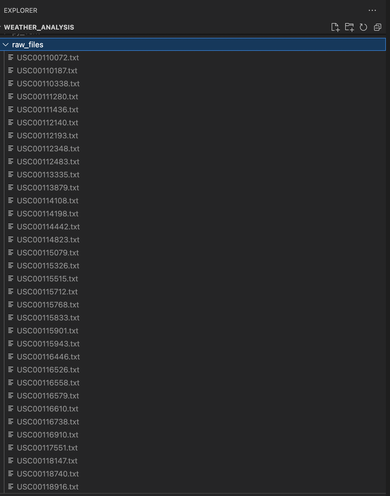

* ### Data Transformation and analysis - transform.py:

    1. This part is done using Apache Spark engine. We utilize the .txt files created, instatiate a Sparksession to create a spark dataframe
    *     raw_files read into a spark dataframe
    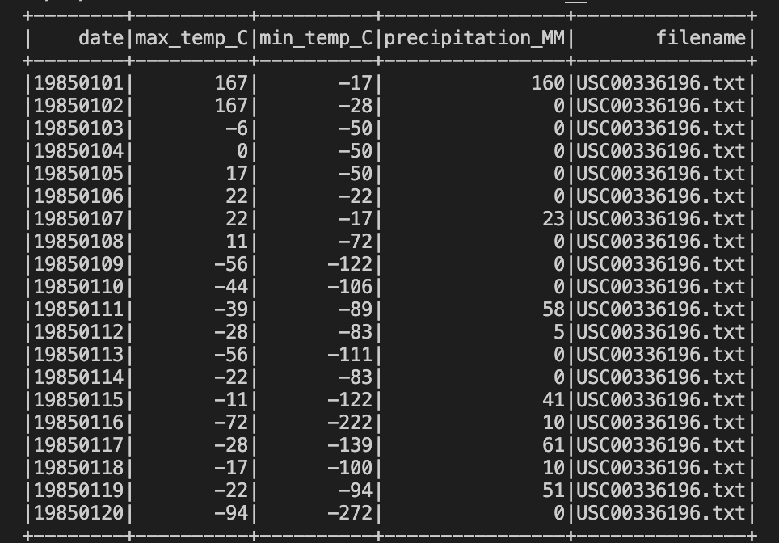

    2. The txt-file based data frame (with raw data) is cleansed and transformed with applying approriate data types replacing missing vales with NULLS and creating a key that will act as a unique identifier.
    *     w_key: A combination of date and region
    *     raw data after cleansing
    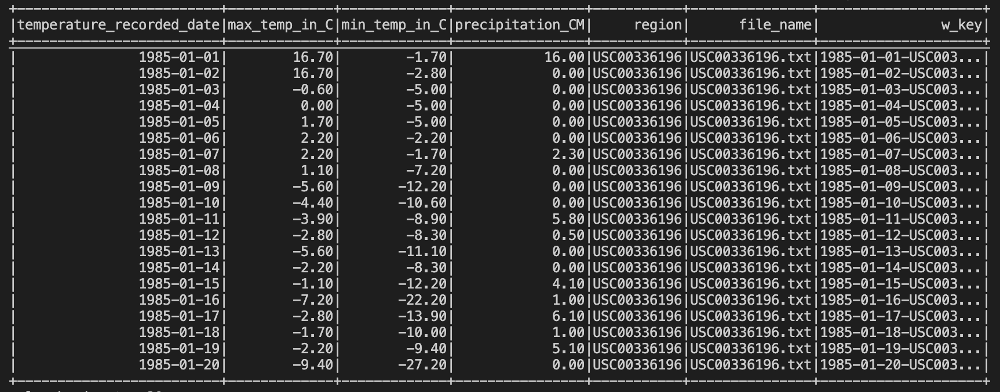
    *     schema
    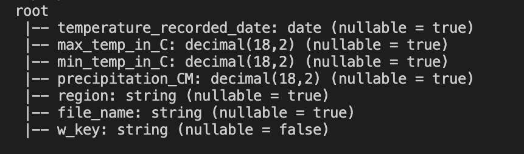

    3. The cleansed data set is used for performing calculations and aggregations.
    *     aggregated data by year and region
    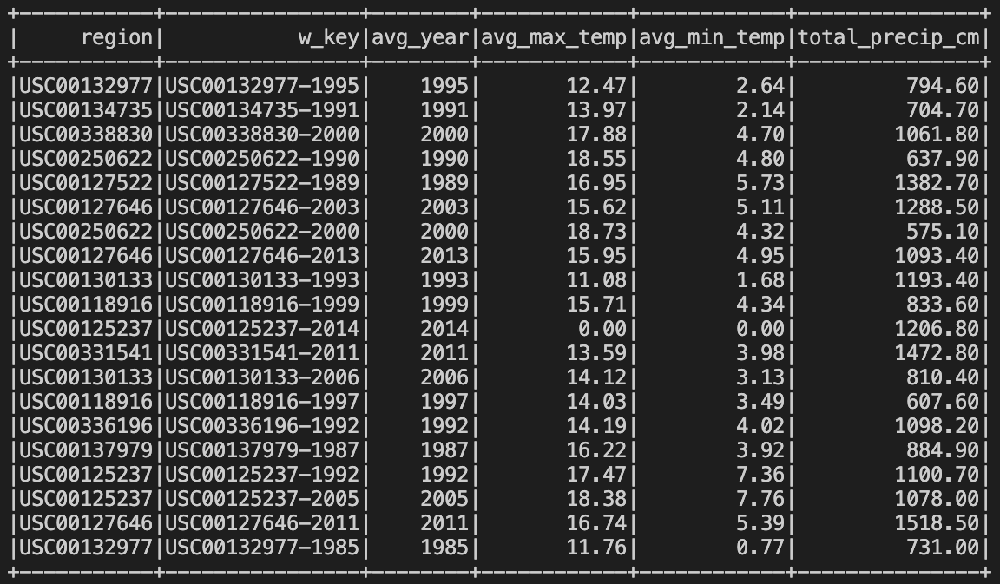

    4. We sink the two datasets back into a different folder as .csv files, which is used to insert into a database and expose the data via an API.
    
    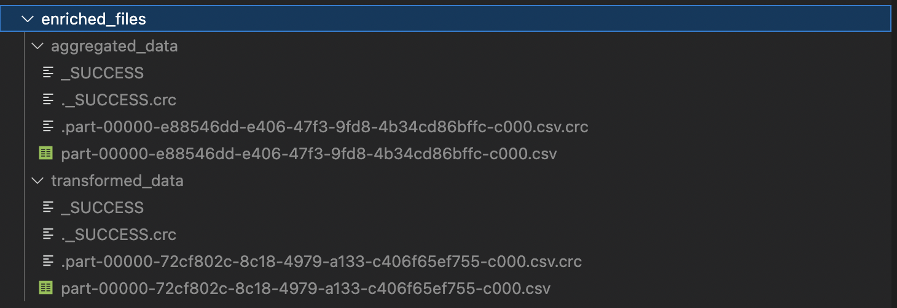

    5. The SQL for the questions asked below are part of function **aggregated_dataset()**

           a. Average maximum temperature by year and station (in degrees Celsius)
           b. Average minimum temperature by year and station (in degrees Celsius)
           c. Total accumulated precipitation by year and station (in centimeters)
            

* ### Databse - SQLite - database_read_write.py: 

    1.  **SQLite** database is used as it's easy to spin it up, lightweight and works seamless with native python.

    2. We have a **DbWrite** class that spins up a database in SQLite and different methods in the DbWrite class perform DDL, DML, DCL operations.
    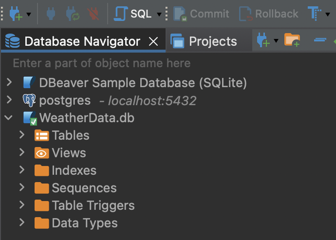

    3. We have two (**create_aggregate_table()** and **create_transformed_table()**) methods that create the tables one for the transformed data one for the the calculated data.

    4. The two tables are created under the database (**WeatherData.db**) that was spin up while instatiating the DbWrite class.
     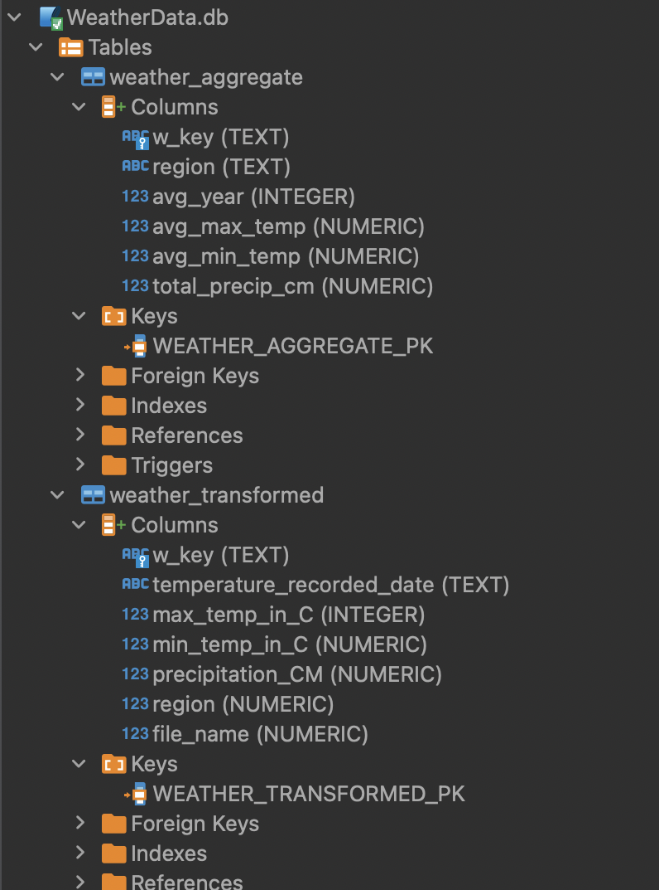

    ### Table Design: 

    1. There are two tables that hold the data at two different grain levels
        * **weather_transformed**: The data is similar to the raw data (.txt) where it has the lowest grain level i.e weather recorded per day and other respective attributes. Additional attributes like **w_key**, **file_name** are used for unique constraint, if we run the same operation twice it will throw an error and not create duplication within the table.
        * **weather_aggregate**: This table answers the following 3 questions grouped by year and weather station region. Hence the grain level of this data is different to the **weather_transformed** table.
        **aggregated_dataset()** function in **transform.py** contains the logic that populates the table **weather_aggregate**.
            * Average maximum temperature by year and station (in degrees Celsius)
           *  Average minimum temperature by year and station (in degrees Celsius)
            * Total accumulated precipitation by year and station (in centimeters)
    2. Further non-clustered indexing can be done on **station code/region** if we determine any use case for joins between the two tables.
    3. A non-clustered index can be designed on columns like **temperature_recorded_date**,**region**,**avg_year** from both the tables as they are used in query parameters in API, This will help seek the results quicker as the volume of data increases.
    4. For any **NULL** value in maximum temperature, minimum temperature or precipitation recorded for a particular date, we identify it as 0 to calculate the average.
        
           Data from table weather_transformed
        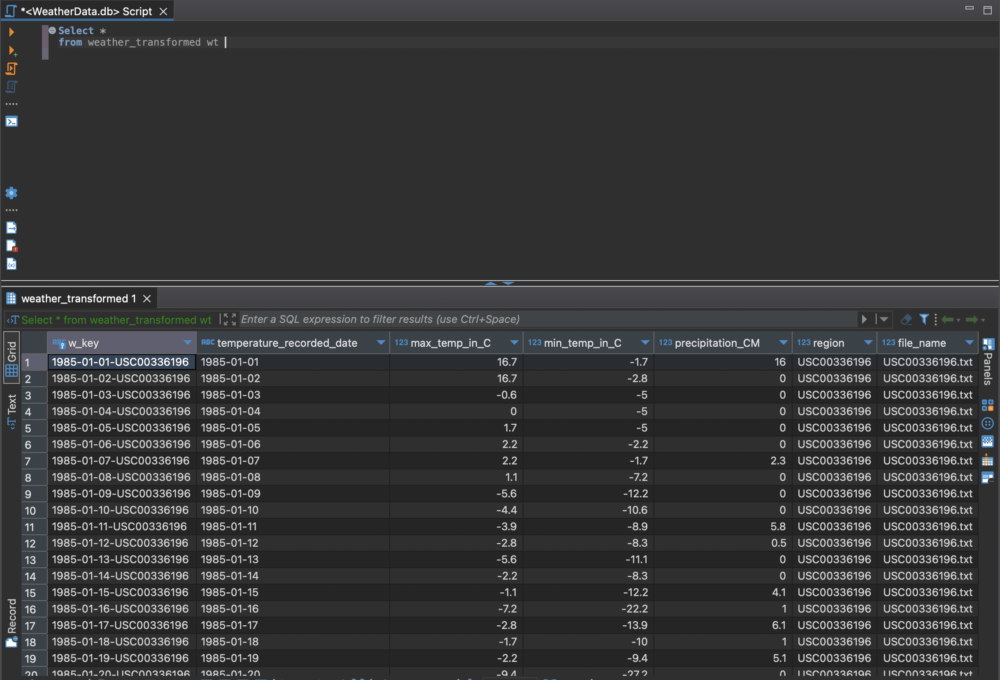
                    
           Data from table weather_aggregate
        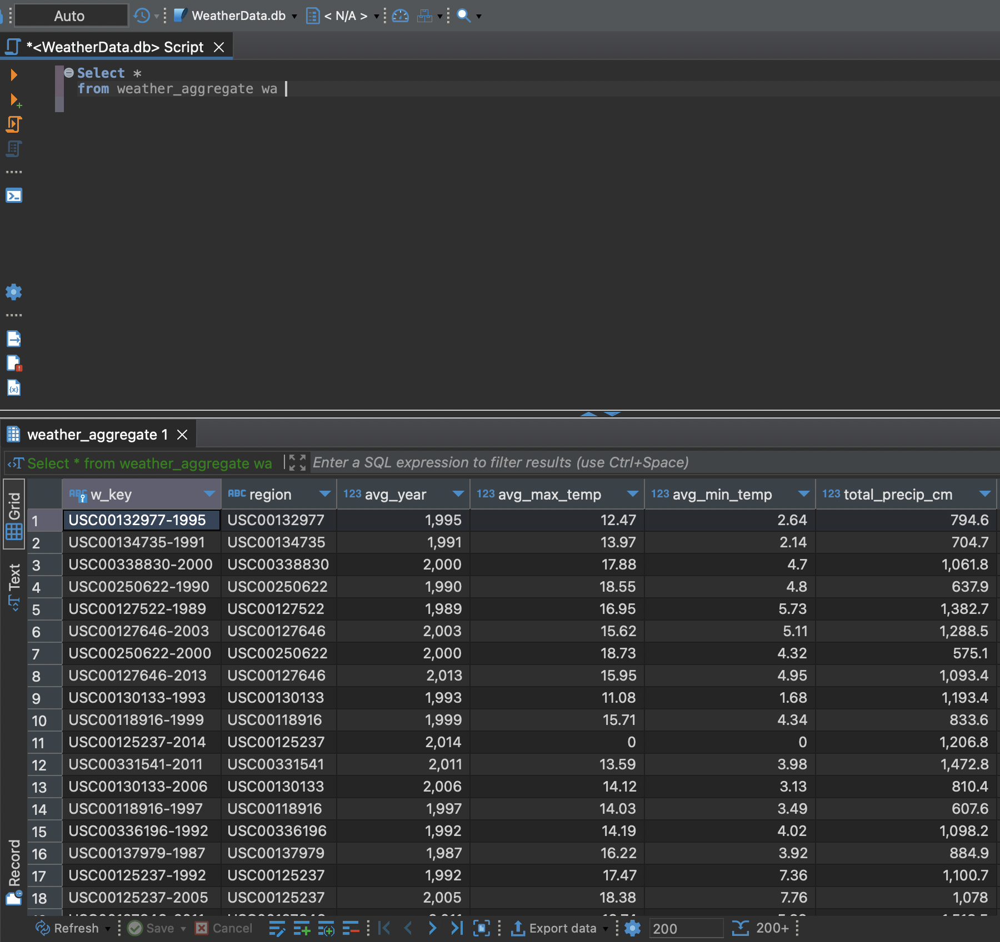

    4. The data in these tables is used to expose it via. an API
    
# app.py - REST API
  
  * Flask API will run on: http://127.0.0.1:5000/

  * Flask documentation: https://flask.palletsprojects.com/en/2.2.x/

  
  * There are 6 GET methods designed to fetch data from the database based on query parameters, currently designed to run only on the host we run the flask app.
    1. **api_get_weather_form_data(lower,upper)** 
         
         a. This function retrieves data from the database table **weather_transformed** which contains the raw cleansed data based on lower page bound and upper page bound. 
         
         b. The query used to fetch the data comes from the function **get_transformed_data(lower, upper)**.

         c. This function will only retrieve <= 100 rows based on upper and lower limit including to support pagination of the GET method. This will also help with the performance of the API to fetch results quickly.

         d. URL: http://127.0.0.1:5000/api/weather/1/100 , 1 and 100 represent the upper and lower bound results per page, these numbers can be changed in intervals of 100. Note: if the interval is set > 100 the query still shows 100  results.

         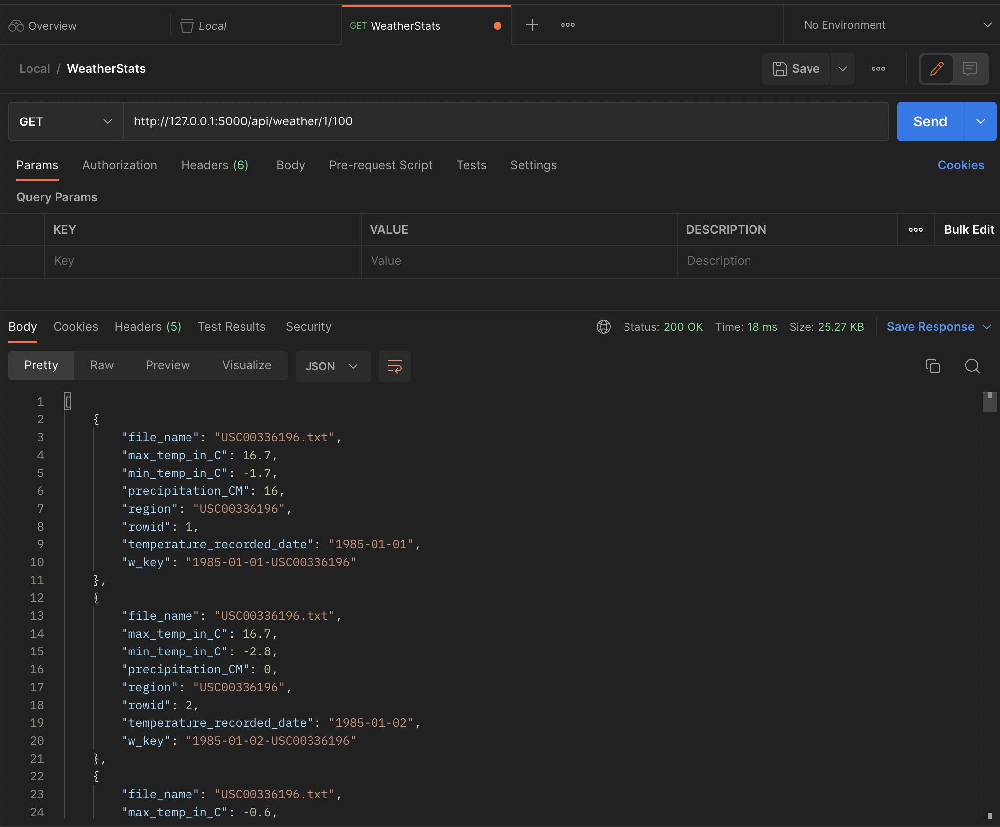

    2. **api_get_weather_agg_data(lower,upper)** 
         
         a. This function retrieves data from the database table **weather_aggregate** which contains the calculated data based on lower page bound and upper page bound. 
         
         b. The query used to fetch the data comes from the function **get_aggregate_data(lower, upper)**.

         c. This function will only retrieve <= 100 rows based on upper and lower limit including to support pagination of the GET method. This will also help with the performance of the API to fetch results quickly.

         d. URL: http://127.0.0.1:5000/api/weather/stats/1/100 , 1 and 100 represent the upper and lower bound results per page, these numbers can be changed in intervals of 100. Note: if the interval is set > 100 the query still shows 100  results.

        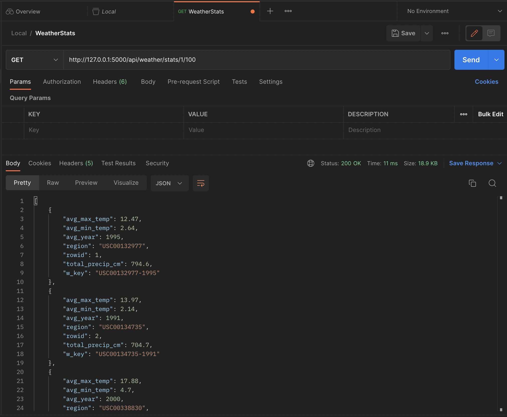

    3. **api_get_transf_count()** 
         
         a. This function retrieves the toal data count from the database table **weather_transformed** which contains the calculated data, This can help with how many times you may to make a call to the API to fetch all the results. 
         
         b. The query used to fetch the data comes from the function **get_count_transf()**.

         c. This function will only retrieve 1 row - that is the count from the table in the database. 

         d. URL: http://127.0.0.1:5000/api/weather/transf/count 

         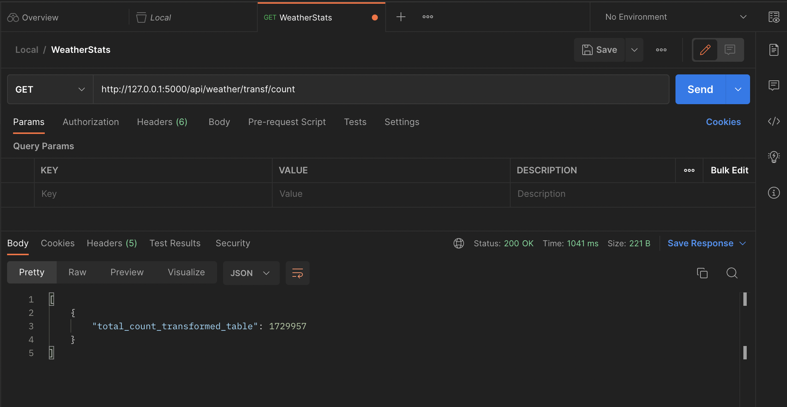

    4. **api_get_aggr_count()** 
         
         a. This function retrieves the toal data count from the database table **weather_aggregate** which contains the calculated data, This can help with how many times you may to make a call to the API to fetch all the results. 
         
         b. The query used to fetch the data comes from the function **data = db.get_count_agg()**.

         c. This function will only retrieve 1 row - that is the count from the table in the database. 

         d. URL: http://127.0.0.1:5000/api/weather/agg/count

         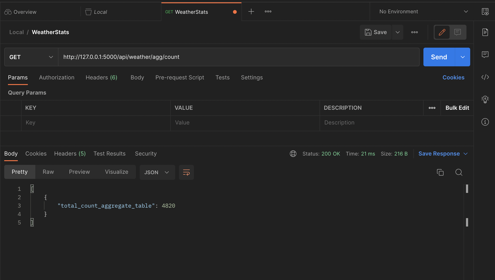

    5. **api_get_weather_form_data_yr_reg(region,temperature_recorded_date)** 
         
         a. This function retrieves data from the database table **weather_transformed** which contains the raw cleansed data based the temperature recorded date and station/region. 
         
         b. The query used to fetch the data comes from the function **get_transformed_data_by_region_date(region,temperature_recorded_date)**.

         c. This function will only retrieve 1 row - all attributes from the day the temperature has been recorded and station/region.

         d. URL:  http://127.0.0.1:5000/api/weather/filter/USC00336196/1985-04-10 ,**USC00336196** represents the station/region parameter and **1985-04-10** represents the day temperature has been recorded.

         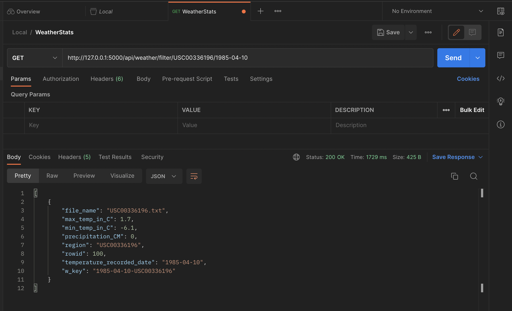
    
    5. **api_get_weather_agg_data_yr_reg(avg_year,region)** 
         
         a. This function retrieves data from the database table **weather_transformed** which contains the raw cleansed data based the temperature recorded date and station/region. 
         
         b. The query used to fetch the data comes from the function **get_aggregate_data_by_region_year(avg_year,region)**.

         c. This function will only retrieve 1 row - all attributes from the day the temperature has been recorded and station/region.

         d. URL:  http://127.0.0.1:5000/api/weather/stats/filter/1995/USC00132977 ,**USC00132977** represents the station/region parameter and **1995** represents the year the averages of temperature and the total precipitation are calculated.

         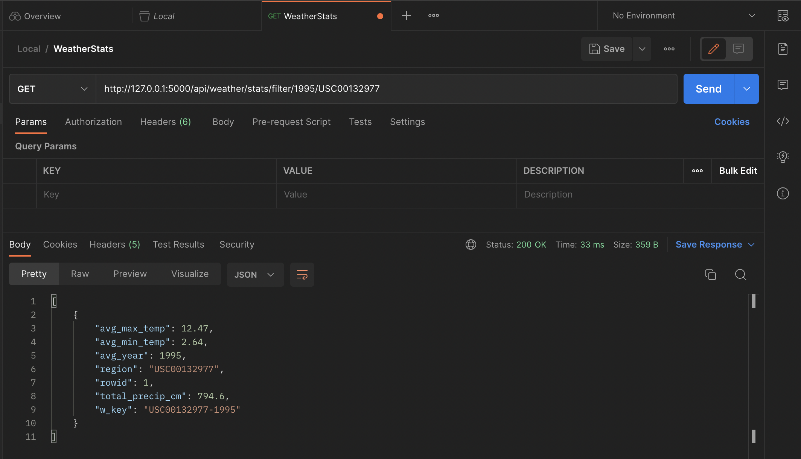

    ### The api can be run from CLI using the below command or executing the **app.py** file 
        flask --app app run

# AWS services that can be used for deployment of this project

* **Amazon EC2**: EC2 is a web service that provides resizable compute capacity in the cloud. You can use EC2 to create a virtual machine to run Flask, the database, and the data ingestion code.

* **Amazon RDS**: Amazon RDS is a managed relational database service that provides an easy-to-set-up, operate, and scale database in the cloud. You can use Amazon RDS to deploy a database that can fetch data to publish in the API and connect with Flask.

* **Amazon S3**: Amazon S3 is an object storage service that can be used to store large amounts of data in the cloud. You can use Amazon S3 to store files and data that are accessed by the data ingestion code.

* **Amazon API Gateway**: Amazon API Gateway is a fully managed service that makes it easy for developers to create, publish, maintain, monitor, and secure APIs at any scale. You can use Amazon API Gateway to deploy the API.

* **AWS Lambda**: AWS Lambda is a serverless compute service that lets you run code without provisioning or managing servers. You can use AWS Lambda to schedule the data ingestion code written in Python and Apache Spark to run at specific times.

* **Apache Spark on Amazon EMR**: Amazon EMR is a managed cluster platform that simplifies running big data frameworks, such as Apache Spark and Apache Hadoop, on AWS. You can use Amazon EMR to deploy Apache Spark and run the data ingestion code.

* **Amazon CloudWatch**: Amazon CloudWatch is a monitoring and observability service that can be used to monitor the performance of the API, database, and data ingestion code. You can use Amazon CloudWatch to set up alarms and notifications based on metrics such as CPU utilization, database connections, and error rates.

* **AWS Identity and Access Management (IAM)**: AWS IAM is a web service that helps you securely control access to AWS resources. You can use AWS IAM to create and manage AWS users and groups, and to control access to the API, database, and data ingestion code.

   